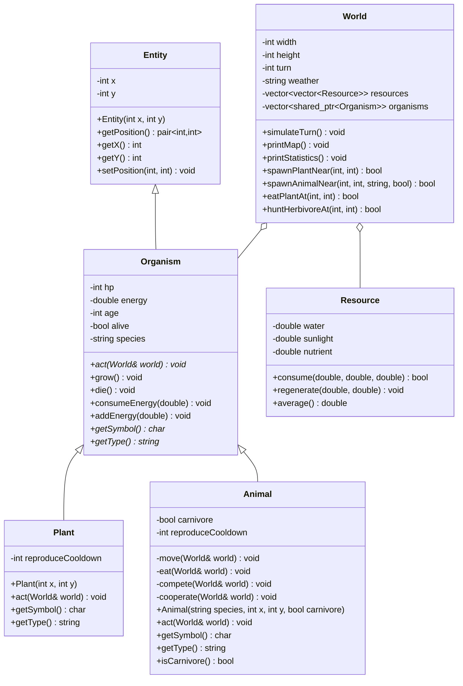

# EcoSim UML Class Diagram

可將以下 Mermaid UML 貼到支援 Mermaid 的編輯器中觀看，例如 Markdown Preview Mermaid Support。

```mermaid
classDiagram
    class Entity {
        -int x
        -int y
        +Entity(int x, int y)
        +getPosition() pair~int,int~
        +getX() int
        +getY() int
        +setPosition(int, int) void
    }

    class Organism {
        -int hp
        -double energy
        -int age
        -bool alive
        -string species
        +act(World& world)* void
        +grow() void
        +die() void
        +consumeEnergy(double) void
        +addEnergy(double) void
        +getSymbol()* char
        +getType()* string
    }

    class Plant {
        -int reproduceCooldown
        +Plant(int x, int y)
        +act(World& world) void
        +getSymbol() char
        +getType() string
    }

    class Animal {
        -bool carnivore
        -int reproduceCooldown
        -move(World& world) void
        -eat(World& world) void
        -compete(World& world) void
        -cooperate(World& world) void
        +Animal(string species, int x, int y, bool carnivore)
        +act(World& world) void
        +getSymbol() char
        +getType() string
        +isCarnivore() bool
    }

    class Resource {
        -double water
        -double sunlight
        -double nutrient
        +consume(double, double, double) bool
        +regenerate(double, double) void
        +average() double
    }

    class World {
        -int width
        -int height
        -int turn
        -string weather
        -vector~vector~Resource~~ resources
        -vector~shared_ptr~Organism~~ organisms
        +simulateTurn() void
        +printMap() void
        +printStatistics() void
        +spawnPlantNear(int, int) bool
        +spawnAnimalNear(int, int, string, bool) bool
        +eatPlantAt(int, int) bool
        +huntHerbivoreAt(int, int) bool
    }

    Entity <|-- Organism
    Organism <|-- Plant
    Organism <|-- Animal
    World o-- Resource
    World o-- Organism
```
